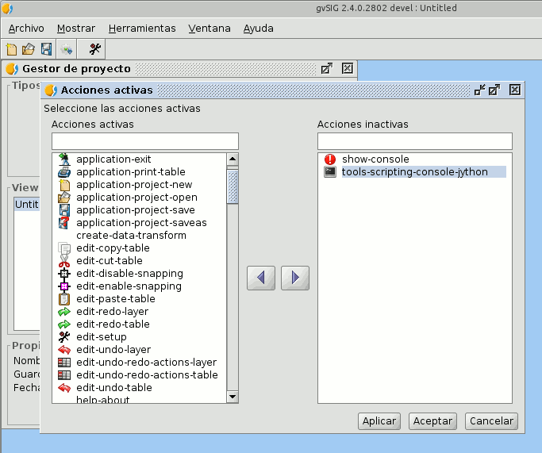

Descripción
==============

Esta utilidad permite activar o desactivar acciones de gvSIG.
Las acciones son usadas en menus y barras de herramientas, de forma que 
desactivar una accion la hara desaparecer de todos los menus y barras de 
herramientas en las que aparezca.

Puede lanzar la herramienta ejecutando directamente el script *"activeActions"*
o acceder a la pagina "Active actions" de las preferencias de gvSIG.

Si no desea que este disponible esta utilidad en las preferencias de gvSIG, 
puede pedir las propiedades del script *"autorun"* y desactivar su ejecucion.
La herramienta seguira estando disponible a traves del script *"activeActions"*.

Traducciones
==============

Esta utilidad añade las siguientes cadenas de traduccion::

  _Active_actions=Acciones activas
  _Inactive_actions=Acciones inactivas
  _Select_active_actions=Seleccione las acciones activas

Estas cadenas vienen traducidas por defecto al español e ingles.

